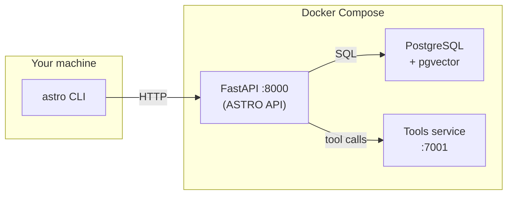
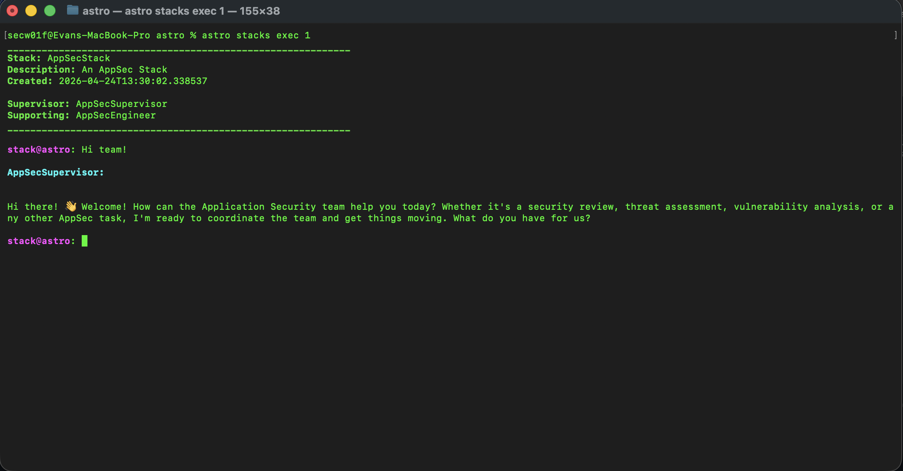

# ASTRO

**A**gentic **S**ecurity **T**eam for **R**esourceful **O**ptimization
```
      ___           ___           ___           ___           ___     
     /\  \         /\  \         /\  \         /\  \         /\  \    
    /::\  \       /::\  \        \:\  \       /::\  \       /::\  \   
   /:/\:\  \     /:/\ \  \        \:\  \     /:/\:\  \     /:/\:\  \  
  /::\~\:\  \   _\:\~\ \  \       /::\  \   /::\~\:\  \   /:/  \:\  \ 
 /:/\:\ \:\__\ /\ \:\ \ \__\     /:/\:\__\ /:/\:\ \:\__\ /:/__/ \:\__\
 \/__\:\/:/  / \:\ \:\ \/__/    /:/  \/__/ \/_|::\/:/  / \:\  \ /:/  /
      \::/  /   \:\ \:\__\     /:/  /         |:|::/  /   \:\  /:/  / 
      /:/  /     \:\/:/  /     \/__/          |:|\/__/     \:\/:/  /  
     /:/  /       \::/  /                     |:|  |        \::/  /   
     \/__/         \/__/                       \|__|         \/__/    

______________________________________________________________________

```

---

> **ASTRO turns AI agents into an extension of the security engineer.**

Most AI in security stops at analyzing output.  
ASTRO goes further—agents **use memory, documentation, and real tools** to execute workflows the way engineers actually work.

---

## What ASTRO Does

ASTRO is an **agentic execution layer for security workflows**.

It enables agents to:

- **Build context** from prior findings (memory)
- **Apply knowledge** from documentation and past analysis
- **Execute real tools** via MCP/API abstractions
- **Iterate like an engineer** through investigation loops

> This isn’t just AI summarizing results—  
> **it’s AI doing security work.**

---

## The Core Idea

Security work is a loop:

1. **Recall context** (What have I seen before?)
2. **Research & reason** (What does this mean?)
3. **Execute tools** (Validate, explore, exploit)

ASTRO replicates this loop.

---

## Why ASTRO is Different

Most systems:
- Ingest scan results
- Summarize findings
- Generate reports

ASTRO:
- **operates tools**
- **chains workflows**
- **maintains context across runs**

> **Agents don’t just read output—they work the problem.**

---

## Architecture



**Data flow:** CLI talks to the API over HTTP. The API persists state in PostgreSQL (with pgvector) and runs agent tool calls against the tools service.

### Components

| Component | Role |
|-----------|------|
| **api** | Agent orchestration, workflow execution, LLM coordination |
| **db** | Persistent memory + vector context (pgvector) |
| **tools** | MCP/API-exposed tooling for agent execution |
| **cli** | Local interface to run workflows and interact with agents |

---

## How It Works

1. Tools are exposed via **MCP or API interfaces**
2. Agents can invoke them like **functions**
3. Memory + documentation provide **context**
4. Workflows emerge as **execution loops**, not scripts

> ASTRO separates **how tools are used** from **where they run**  
> while keeping execution grounded in real environments.

---

## Custom toolsets

The bundled `tools/` service ships with the core stack. To publish and host your own tool namespaces outside that deployment, start from the **[astro-toolset-template](https://github.com/secw01f/astro-toolset-template)** repository.

The template follows the same layout as ASTRO’s `tools/` package:

| Path | Description |
|------|-------------|
| `tools/api.py` | FastAPI app, JWT middleware, router registration |
| `tools/src/<namespace>/` | One package per namespace (e.g. `dns`, `web`) |
| `tools/src/<namespace>/tools.py` | Tool definitions and registry |
| `tools/src/<namespace>/__init__.py` | `APIRouter` with `GET /tools` and `POST /exec` |

Each namespace is mounted at `http://<host>:7001/<namespace>` and exposes the same list/exec contract agents expect from the bundled tools service.

**Authentication:** External toolsets use **Bearer JWT** (HS256, signed with `JWT_SECRET` on the tool host). Register the toolset in ASTRO with auth required, auth type **bearer**, and the JWT as the credential token. ASTRO sends `Authorization: Bearer <token>` on tool calls. The bundled `astro/tools` service uses internal HMAC signing instead—do not mix the two models on the same host without understanding the difference.

**Typical workflow:**

1. Copy `tools/src/example/` to a new namespace in the template and define tools with the `@tool(...)` decorator.
2. Wire the router in `tools/api.py` (protected prefix + `include_router`).
3. Run locally or via Docker Compose (default port **7001**).
4. Register the toolset URL in ASTRO (CLI or API), e.g. `http://your-host:7001/<namespace>`.

For JWT issuance, namespace setup, and run instructions, see the [template README](https://github.com/secw01f/astro-toolset-template).

---

## Quick Start

From the repository root:

```bash
chmod +x deploy.sh
./deploy.sh
```

This will:

1. Build and start:
   - API
   - Tools service
   - Database
2. Install the CLI via **pipx** or local **venv**

---

### After startup

- API → http://localhost:8000  
- CLI → `astro init` then `astro --help`

`./deploy.sh` prints one-time credentials for the default `stack` user. Run `astro init` to set the API URL, log in, create your permanent account, and set your password in one flow.

---

## Configuration

### Backend

Copy:

```bash
cp .env.example .env
```

Update values like:

- `DB_URL`
- `SECRET_KEY`
- `DEFAULT_TOOLS_BASE_URL`

---

### CLI

Interactive setup (recommended on first install):

```bash
astro init
```

Non-interactive (URL only):

```bash
astro init --url http://localhost:8000 --skip-login -y
```

View or change settings later:

```bash
astro config show
astro config url http://localhost:8000
```

Environment variables override the config file:

- `ASTRO_API_URL`
- `ASTRO_API_TOKEN`

---

## CLI Overview

| Area | Examples |
|------|----------|
| Setup | `astro init` |
| Config | `astro config show`, `astro config url` |
| Auth | `astro auth login` |
| Agents | `astro agent list` |
| Tools | `astro tool list` |
| LLMs | `astro llm list` |
| Docs | `astro docs` |



---

## Project Layout

| Path | Description |
|------|-------------|
| `api/` | Core backend, orchestration, agent logic |
| `client/` | CLI interface (`astro`) |
| `tools/` | Tool execution service |
| `docker-compose.yaml` | Runtime services |

---

## Use Cases

- Vulnerability triage and prioritization
- Offensive security workflows (recon → validation → exploitation)
- Detection and response investigations
- Security automation with real tool execution

---

## Philosophy

ASTRO is built on a simple belief:

> **AI should not replace security engineers.  
> It should extend how they already work.**

---

## License

MIT — see [LICENSE](LICENSE)
