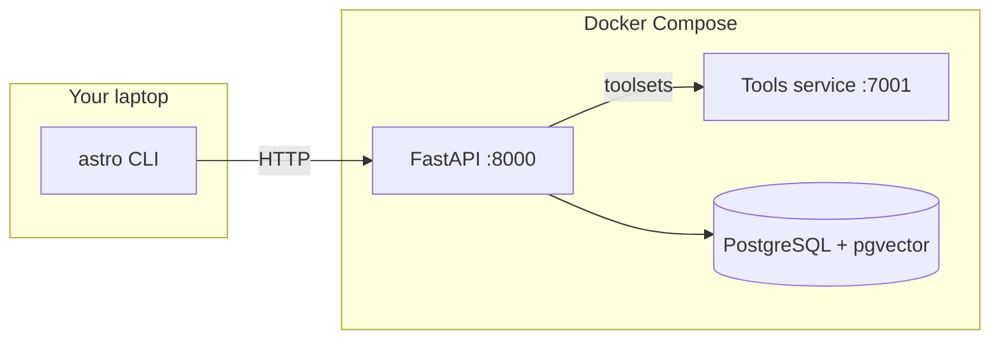

# ASTRO

**A**gentic **S**ecurity **T**eam for **R**esourceful **O**ptimization

---

ASTRO is an **agentic backend** for security workflows: compose **stacks** of specialized agents (supervisors and supporting roles across AppSec, GRC, Detection & Incident Response, Offensive Security, and Vulnerability Management), wire them to **LLMs** and **toolsets**, and drive everything from a **CLI** or the API so ASTRO fits into how you really work as an engineer.

---

## Architecture



| Component | Role |
|-----------|------|
| **api** | REST API, agent/stack/tool/LLM orchestration |
| **db** | Persistent storage; vectors via pgvector |
| **tools** | HTTP toolsets (e.g. web-style tools) consumed by the API |

---

## Prerequisites

- **Docker** and **Docker Compose** (for the stack)
- **Python 3.13+** (for the CLI client; see `client/pyproject.toml`)

---

## Quick start (recommended)

From the repository root:

```bash
chmod +x deploy.sh
./deploy.sh
```

This will:

1. Run `docker compose up -d --build` (API, tools, database)  
2. Install the CLI with **pipx** if available, otherwise a **venv** under `client/.venv`  

After it finishes:

- **API:** [http://localhost:8000](http://localhost:8000)  
- **CLI:** `astro --help` (ensure `~/.local/bin` is on your `PATH` if you used pipx)

On first API startup, a default user and tool bootstrap run automatically; watch the API logs for the generated credentials for the `stack` user.

### Manual compose (no `deploy.sh`)

```bash
docker compose up -d --build
```

Then install the client from `client/` (pipx or venv). Step-by-step options—including Windows—are in [`client/README.md`](client/README.md).

---

## Configuration

- **Backend:** copy `.env.example` to `.env` and adjust as needed (`DB_URL`, `SECRET_KEY`, `DEFAULT_TOOLS_BASE_URL`, etc.).  
- **CLI:** `astro config` writes `~/.astro/config.json`. You can also use `ASTRO_API_URL` and `ASTRO_API_TOKEN` for non-interactive use.

---

## CLI overview

| Area | Examples |
|------|----------|
| **Config** | `astro config url`, `astro config token` |
| **Auth** | `astro auth login` (after you have an account) |
| **Agents** | `astro agent list`, `astro agent create` |
| **Tools** | `astro tool list`, … |
| **LLMs** | `astro llm list`, … |
| **Docs** | `astro docs` |

Full install paths and troubleshooting: [`client/README.md`](client/README.md).

---

## Project layout

| Path | What |
|------|------|
| `api/` | FastAPI app, routers, DB models, agent/stack logic |
| `client/` | `astro` CLI (Click + httpx) |
| `tools/` | Tool service used by the API |
| `docker-compose.yaml` | `api`, `tools`, `db` services |

---

## License

MIT — see [LICENSE](LICENSE).
